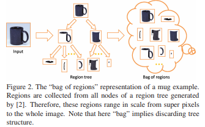

# Object detection (OD)

Object detection requires localization.

## Extract Regions Of Interest (ROI)
Sequential steps of region extraction, region proposal, evaluation of ROI relevance.

### 1- Region extraction

Construct region tree using hierarchical segmentation engine, either with contours or occlusion boundaries. In this step, we segment the whole image and attribute a region to each pixel, in a hierarchical manner.  

- **From contours to regions: An empirical evaluation** [[url](https://vision.ics.uci.edu/papers/ArbelaezMFM_CVPR_2009/ArbelaezMFM_CVPR_2009.pdf)](_Arbelaez et al. CVPR 2009_)  
Oriented Watershed Transform (OWT) to form initial regions from contours, followed by construction of an Ultrametric Contour Map (UCM) defining a hierarchical segmentation.  

- **Recovering occlusion boundaries from an image** [[url](https://www.ri.cmu.edu/pub_files/pub4/hoiem_derek_2007_3/hoiem_derek_2007_3.pdf)](_Hoeim et al. ICCV 2007_)  
Segmentation using occlusion boundaries.  
[[https://github.com/laure-delisle/lit-review/blob/master/img/object_detection/occlusion_recovery.png|alt=Occlusion recovery]]

### 2- Region proposal

From hierachical segmentation, we construct regions of interest, either by agglomerative grouping, bagging or using RPN (new approach by Faster R-CNN).

- **Category independent proposal** [[ur](http://dhoiem.cs.illinois.edu/publications/eccv2010_CategoryIndependentProposals_ian.pdf)](_Endres et Hoeim, ECCV 2010_)  
Hierarchical segmentation with agglomerative grouping, based on boundary strength. Then groups newly obtained regions with seeding: starting from a region, appearance and boundaries around the seed are used to identify other regions that might belong to the same object. Uses _Hoeim 2007_  

- **Recognition using regions** [[url](http://www-bcf.usc.edu/~limjj/paper/glam_cvpr09.pdf)]
(_Gu et al., 2009 CVPR_), used for both object detection and semantic segmentation.  
Produces a "robust bag" of overlaid regions (Region=set of image cues (color, texture, shape)), learns region weights using a max-margin framework. Uses _Arbelaez 2009_  

- **Region Proposal Networks** (_Faster R-CNN_)   
Produces a set of rectangular region proposals each with an objectness score, from an _n x n_ window input taken from a feature map.  
After mapping to a lower dimension feature map, this _n x n_ window is fed to two sibling _1 x 1_ conv networks: **box-regression** layer (reg) and **box-classification** layer (cls). At each sliding-window location, we simultaneously predict _k_ region proposals. The reg layer has 4k outputs encoding the coordinates of k boxes, and the cls layer outputs 2k scores that estimate probability of object or not object for each proposal. The k proposals are parameterized relative to k reference boxes, which we call **anchors**. An anchor is centered at the sliding window in question, and is associated with a scale and aspect ratio. By default RPN use 3 scales and 3 aspect ratios, yielding k = 9 anchors at each sliding position. For a convolutional feature map of a size W × H, there are W x H x k anchors in total.   
note: this method is translation invariant (in terms of anchors and function prediction the ROI based on the anchor).   

### 3- Evaluate how good/relevant the extracted regions are

- **Measuring the objectness of image windows** [[url](http://calvin.inf.ed.ac.uk/wp-content/uploads/Publications/alexe12pami.pdf)](_Alexe et al., TPAMI 2012_)  
Distinguish objects with a well-defined boundary in space, such as cows and telephones, from amorphous
background elements, such as grass and road. The measure combines in a Bayesian framework several image cues measuring characteristics of objects:  
. well-defined closed boundary in space [Edge density, Superpixels straddling],  
. different appearance from its surroundings [Color contrast],  
. unique within the image and stands out as salient [Multi-scale saliency].   
note: Region Proposal Networks (RPN) output this along the ROI (same step).  

### R-CNN (region) [[url](https://arxiv.org/pdf/1311.2524.pdf])]
> _Girshick et al., UC Berkeley, 2014 CVPR_

### Fast R-CNN [[url](https://arxiv.org/pdf/1504.08083)]
> _Girshick et al., Microsoft Research, 2015 ICCV_

### Faster R-CNN [[url](https://arxiv.org/abs/1506.01497)]
> _Ren et al., 2015 NIPS_

### YOLO (you only look once) [[url](https://arxiv.org/pdf/1506.02640.pdf)]
> _Redmon et al., UW Allen Institute for AI and FAIR, 2016 CVPR_

### R-FCN [[url](https://arxiv.org/pdf/1605.06409.pdf)]
> _Dai et al., Microsoft Research, 2016 NIPS_

### SSD [[url](https://arxiv.org/pdf/1512.02325.pdf)]
> _Liu et al, UNC Chapel Hill Zoox Google and U Michigan, 2016 ECCV_ 

# Feature extraction

### Feature Pyramid Networks for Object Detection [[url](https://arxiv.org/pdf/1612.03144.pdf)]
> _Lin et al., FAIR and Cornell, 2017 CVPR_

**Observation**: Low-resolution are semantically strong features, high-resolution are semantically weak features. Need to combine both.

**Results**: SOTA on COCO using FPN with Faster R-CNN detector. Can be trained end-to-end.

For generic feature extraction. Uses a pyramidal structure with:
- top-down pathway
- lateral skip connections
- prediction at each level 

Prediction: 3×3 convolution is appended on each merged map to generate the final feature map, which is to reduce the aliasing effect of upsampling

**Related work**  
- _Adelson 1984 - Pyramid methods in image processing_  
Pyramids are scale-invariant.  
(+) this enables a model to detect objects across large range of scales (scan across positions and pyramid levels).  
(-) requires dense scale sampling.

- _He 2016 - Deep Residuals..., Shrivastava 2016 - Training region-based..._  
Convnets + Featurizing each level of an image pyramid.  
(+) multi-scale feature representation with all levels semantically strong, even HR.  
(-) time and memory consuming, impractical in real world.

- _Liu 2016 - SSD: Single shot multibox detector_  
Feature hierarchy layer by layer from Convnet subsampling process.  
(+) feature maps of different spatial resolutions.  
(-) large semantic gaps due to different depths: low-level HR can be harmful for OD-> SSD uses top-down to avoid low-level features, which are needed to detect small objects.

