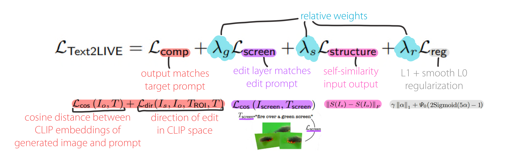

# Tweets about papers I read

## Text2Live
Text-driven image/video editing by @omerbartal et al. Zero-shot using ONE captioned image + pre-trained CLIP model to generate an edit layer. Foreground/background texture edits.
📑paper: https://arxiv.org/abs/2204.02491 https://pic.twitter.com/VowYdgbA4V
